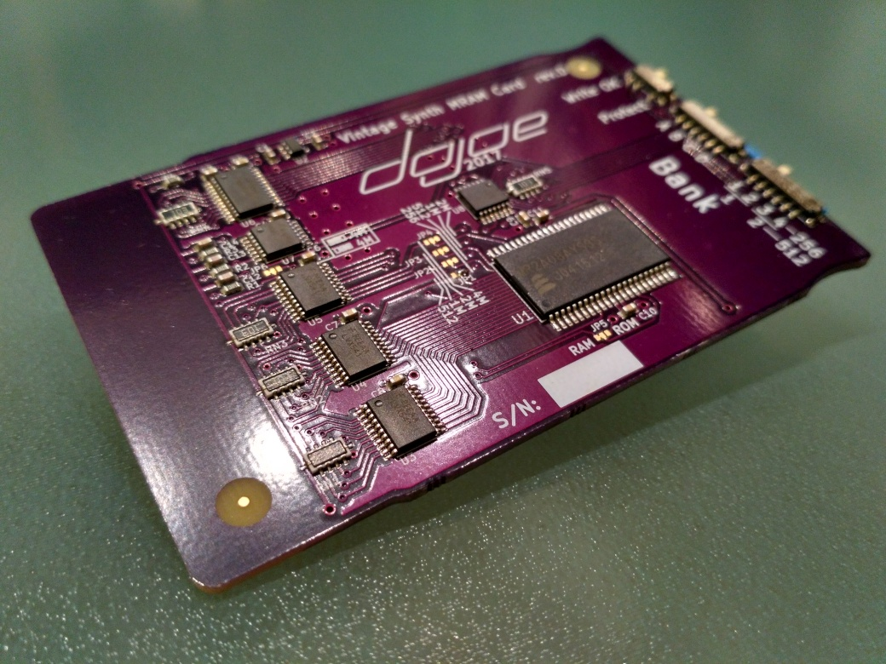

# Roland compatible multi-bank MRAM memory card

 (click to enlarge)

This is a replacement memory card for old Roland instruments of the late 80s and early 90s, such as the D-50 synthesizers, the JV-1080 and JV-2080 rack synths or the JD-880. It is meant to replace memory cards of the M-128, M-256 and M-512 lines (including M-256E, M-512G and all other suffixes). Some Akai devices from the same age actually use a compatible card format (BR-16 and BR-32) and this card will work in those too.

It doesn't need any kind of backup battery since it uses non-volatile MRAM for data storage, and thanks to the large memory chip used it emulates multiple virtual cards ("banks") which are selectable via slide switches - one of these memory cards will emulate 8x M-512 or 16x M-256 depending on the setting of a solder jumper.

The card has been developed with a lot of testing help from the community over at [the VintageSynth forums](https://forum.vintagesynth.com/viewtopic.php?f=24&t=76886) and over 900 units have been manufactured and sold since then - with near zero complaints :) Since the beginning of the project, we had plans to eventually publish the design data and source code for the card so it would stay available to everyone once we stopped making and selling them. So here it is!

## Compatibility

* **Tested and fully compatible:** Roland A-90, D-5, D-50, D-550, D-10, D-110, D-70, U-20, JD-800, JD-990, JV-880, JV-1000, JV-1080, JV-2080, R-880 (GC-8), R-8M, GR-1, GR-50, PM-16, TR-626, Akai MX-1000, VX600.
* **Mostly compatible:** Roland TD-10, TD-20. The card reportedly has errors when inserted all the way, but pulled back 1/8th of an inch it works fine.
* **Not compatible:** Roland VG-8, Peavey Tubefex.
* Some units like the Roland U-110 and U-220 only accept ROM cards, not RAM cards. Naturally, this RAM card replacement does not work in those, either.

## Differences to the cards we sell

Functionally, this design is 100% identical to the cards we sell online. I did make some changes to the appearance however to make homemade cards clearly distinguishable from ours.

Also, one part we use (a Bourns CAT25 SMD resistor network) is no longer being manufactured, so I updated the BOM with a Panasonic part that seems to be a drop-in replacement. We have not tried that replacement part ourselves yet though - please let me know via a GitHub issue whether it's as drop-in as it looks.

## Directories

* [mram-card](mram-card): The memory card hardware design files.
* [datasheets](datasheets): Data sheets for most of the parts used.
* [testbench](testbench): The testbench I'm using to test every card before they go out to customers.

## Making cards

Send the [KiCAD PCB file](mram-card/d50mram.kicad_pcb) or the [Gerbers](mram-card/gerbers.zip) to your favorite board house - or order directly from OSHPark:

<a href="https://oshpark.com/shared_projects/AyL7HCIK"></img></a>

As for parts, check out the [bill of materials](mram-card/d50mram.bom.csv).

# Licenses

## Memory card

 The hardware design of the <a href="https://github.com/dojoe/roland-mram-card">Roland compatible multi-bank MRAM memory card</a> by <a xmlns:cc="http://creativecommons.org/ns#" href="https://github.com/dojoe" property="cc:attributionName" rel="cc:attributionURL">Joachim "dojoe" Fenkes</a> is licensed under a <a rel="license" href="http://creativecommons.org/licenses/by-sa/4.0/">Creative Commons Attribution-ShareAlike 4.0 International License</a>.

## Testbench

Please see the [testbench README](testbench/README.md) for testbench license information.
