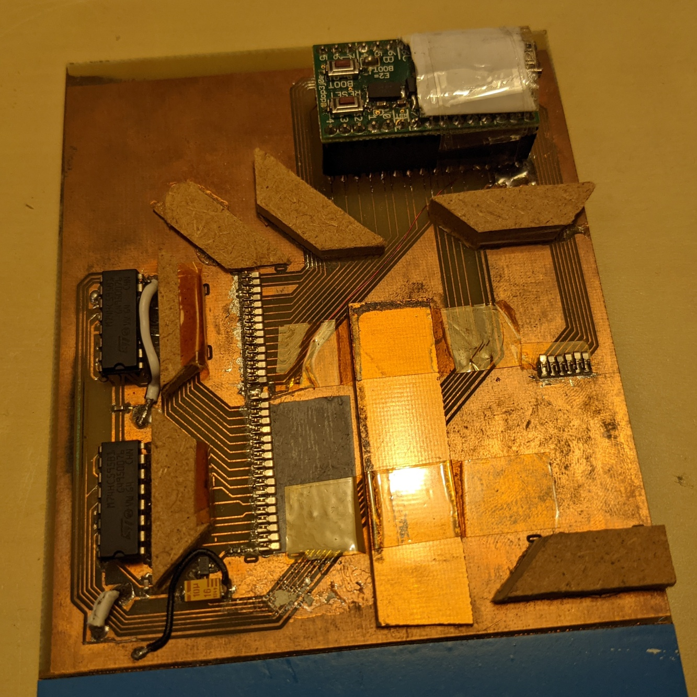

# Roland Memory Card Testbench

 (click to enlarge)

This is a quick and dirty test jig I built to test the memory card. It performs these tests, in order:

1. Check voltage rails (5V provided from outside, 3.3V generated on the card).
2. Single bank full read/write with data checking to test address and data lines.
3. Test write protect and bank switches - the user is prompted to operate the switches while the test program monitors the switch positions.
4. Verify bank switching logic - while the bank switches are tested, the test program writes a byte value identifying the bank to each and checks in a second pass that all values are read back correctly.

In addition to that it also has a couple debugging features: It can write and read memory cards (one bank at a time) and dump the current value of all microcontroller IO ports to the serial console (to test the test jig itself).

# Hardware

The test jig is built around my ATMega32U4 mini breakout board, the TinyMega - any 32U4 based Arduino board should do the trick though. I updated the schematics to reflect a more generic ATMega32U4 and added the user LED and user button that are connected to pins E6 and E2 on my board respectively.

**The PCB layout is only for illustrative purposes and not recommended for use!** It no longer matches the schematics, does not reflect some board modifications I have made in the meantime, and generally is a quick single-sided abomination I whacked together to get a test jig made over the weekend :) You can copy the arrangement of the spring contacts but should really redesign the rest from scratch.

Speaking of which, the spring contacts I've used are ["Micro Universal Contact Z 2.5mm"](../datasheets/springcontact.pdf) by ITT Cannon, Digikey P/N 120220-0312.

As you can see when looking at the schematics, the test jig uses every single I/O pin of the microcontroller. Address bits A0..A15 are generated via a chain of 74HC595 shift registers, all other signals are operated and monitored directly. Pin E6 ends up doing double duty - usually it just drives the LED to indicate test progress but a special 1Mbit write/dump mode was added later on that uses this pin for an additional address line.

A P-MOSFET is used to turn power to the card under test on and off; the small series resistor R2 limits the current in case of a short or near-short on the card. It will also cause a significant voltage drop in case the card isn't shorted but draws more current than expected - this will be detected in step 1 above and will fail the test.

The memory card has six test points that are used to read back the position of the four-way slide switches. The test program will poll these (with some debouncing logic) to pace the progress of steps 3+4 above in lockstep with the user moving the switches.

# Software

The test program is as quick and dirty a hack as is the hardware - it is based on the VirtualSerial demo program from the LUFA USB library, with almost no modifications to the USB serial code. All the test code is contained within [test.c](firmware/test.c), which is the only file _not_ shamelessly yoinked from LUFA.

The test program has four modes:

* Test mode, which will execute the test sequence.
* Dump mode, which will dump the entire card content to the serial console as a binary stream.
* Program mode, which will write binary data coming in via the serial console to the card.
* DIO monitor mode, which will keep printing the state of the I/O ports to the serial console.

For Test, Dump and Program mode, you can additionally select a card size; Test mode supports 256 and 512 kbit, Dump and Program modes additionally support 128 and 1024 kbit cards. The default upon startup is Test mode for 256 kbit cards.

You can switch modes by sending characters over the serial link: t, p, d, m select Test, Program, Dump and Monitor mode respectively, and 1..4 select 128, 256, 512 and 1024 kbit sizes.

To connect to the test jig, use a simple terminal program like [RealTerm](https://realterm.sourceforge.io/).

Regardless of mode, pushing the user button starts an operation.

## Test mode

Once you push the button, the test program will run through the tests in this order:

1. Turn off the user LED (in case it was turned on)
2. Test voltage rails
3. Check that all slide switches are in the right position (write protect off, bank A1 selected)
4. Read/write test of bank A1
5. Detect card size, fail if detected size doesn't match what's configured via serial
6. Turn on the user LED to indicate progress to the user
7. Test write protect switch: User must turn write protect on, then off again
8. Turn the user LED back off
9. Test ABCD bank switch: User must move switch through all positions from A thru D and then back again
10. Test 1234 bank switch in the same way
11. If we get here without error, the test passes - turn on the user LED to indicate success

If any of these steps fails, the test will abort and the user LED will blink. Also, whenever the program is waiting for user action, the user can instead push the button to abort the test.

## Dump mode

Once you push the button, the test program will read the entire card and output the contents to the serial link as a stream of bytes. The idea is that you configure dump mode and the correct size via your terminal program, then start a capture to file in the terminal program and push the button.

## Program mode

This is similar to Dump mode, except that your terminal program will be the one sending bytes to the test jig. As you push the button, the test program will print a message prompting you to send data, then you can have your terminal program send a binary file directly to the serial line. The test program will expect exactly as many bytes as you set up earlier.

# Licenses

 
The hardware (schematics, example layout) of <a property="dct:title" rel="cc:attributionURL" href="https://github.com/dojoe/roland-mram-card/tree/master/testbench">Roland Memory Card Testbench</a> by <a rel="cc:attributionURL dct:creator" property="cc:attributionName" href="https://github.com/dojoe">Joachim "dojoe" Fenkes</a> is marked with <a href="http://creativecommons.org/publicdomain/zero/1.0?ref=chooser-v1" target="_blank" rel="license noopener noreferrer" style="display:inline-block;">CC0 1.0</a>

The actual test code, [test.c](firmware/test.c), is licensed under [the Unlicense](https://unlicense.org).

All other code in the firmware directory is copied or adapted from [LUFA](http://www.fourwalledcubicle.com/LUFA.php) and covered by [LUFA's license](firmware/LUFA/License.txt).
